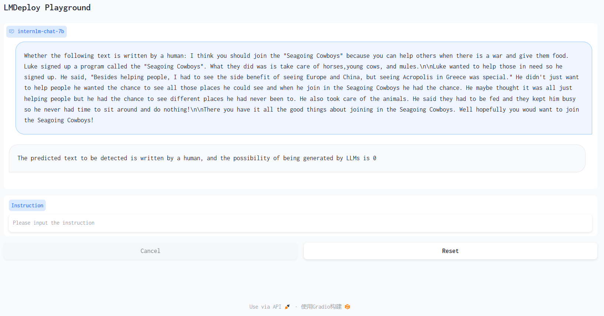
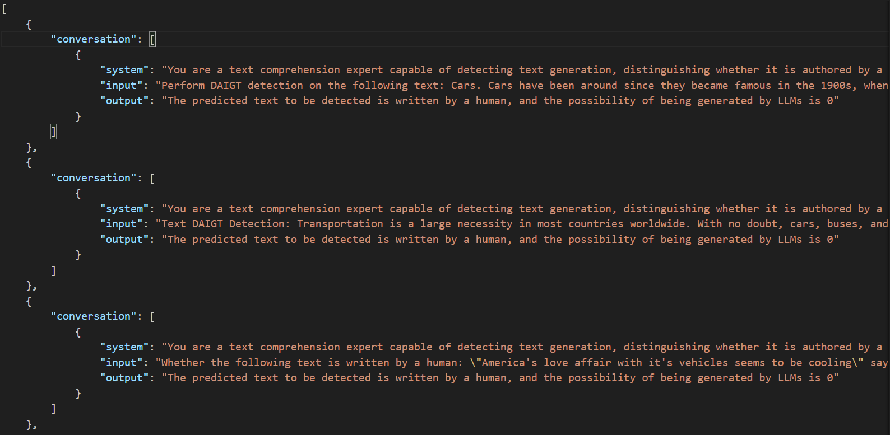
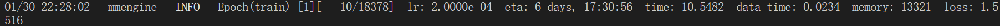
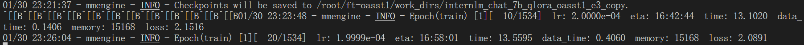
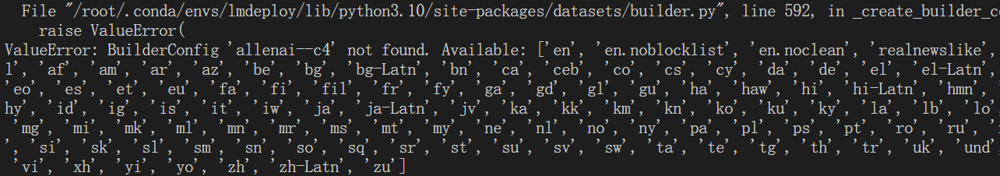

# DAIGT-InternLM


## 介绍
&emsp;&emsp;本库是参加InternLM官方举办的大模型实战训练营大作业，目的是亲自实现对大模型的微调，感谢上海人工智能实验室、OpenXLab提供此次机会。领域微调需要有效数据，正好在Kaggle发现了刚结束的DAIGT竞赛[LLM - Detect AI Generated Text | Kaggle](https://www.kaggle.com/competitions/llm-detect-ai-generated-text/overview)，该竞赛提供了学生和LLM生成的作文文本，要求参赛队伍设计有效算法实现对LLM生成作文文本的准确识别。此竞赛数据集很适合用于LLM微调，并且判断文本是否由LLM生成也是一个有趣的方向，并且该竞赛最终Private榜单第一名[LLM - Detect AI Generated Text | Kaggle](https://www.kaggle.com/competitions/llm-detect-ai-generated-text/discussion/470121)性能最好的方案就是使用Mistral-7B-v0.1模型进行LoRA微调，遂确定将大作业为定为“通过微调InterLM实现LLM生成文本检测”。竞赛的discussion有很多选手分享了经验和tricks，但由于时间原因，本此尝试应该会比较粗糙，感兴趣的朋友可以进一步研究。

训练后的模型性能表现如下，有兴趣的朋友可以在OpenXLab下载模型尝试


##  数据集
DAIGT竞赛组织方提供的数据较少，只提供了1378条由学生撰写的作文文本，没有提供LLM生成的作文文本，LLM生成的作文文本应该需要参赛选手自行生成，在此感谢[Darek Kłeczek | Grandmaster | Kaggle](https://www.kaggle.com/thedrcat)为此竞赛提供了完整的训练数据，方便构建微调InterLM所需的数据。

初步使用[Darek Kłeczek | Grandmaster | Kaggle](https://www.kaggle.com/thedrcat)提供的[daigt-v3-train-dataset (kaggle.com)](https://www.kaggle.com/datasets/thedrcat/daigt-v3-train-dataset)和[DAIGT-V4-TRAIN-DATASET (kaggle.com)](https://www.kaggle.com/datasets/thedrcat/daigt-v4-train-dataset)两个数据集共四个csv文件中的数据构建InterLM微调使用对话数据，经过数据清理后，共构建了140311条conversation数据。因为训练方向是使InterLM能预测一段文本是否有LLMs生成，数据构建数据参考[construct_conversions.ipynb](data/construct_conversions.ipynb)


构建后的数据如下所示：




## 微调
&emsp;&emsp;使用 XTuner 进行微调，具体脚本可参考[internlm_chat_7b_qlora_oasst1_e3_copy.py](./train/internlm_chat_7b_qlora_oasst1_e3_copy.py)，该脚本在`train`文件夹下。脚本内有较为详细的注释。

初次尝试时，因为资源有限，且由于构建的数据中基本都包含较长的作文文本，在20g显存下，全量的140311条数据训练时间接近7天，如下图所示。



为了完成初次验证，先选择随机从140311条数据随机筛选出10%的数据，即14031条数据进行微调，在[internlm_chat_7b_qlora_oasst1_e3_copy.py](./train/internlm_chat_7b_qlora_oasst1_e3_copy.py)中设置max_length=3072、max_epochs=3、batch_size=2、accumulative_counts=16，共需时间为17小时左右



因为使用的数据集只是构建完整数据集的十分之一，故此微调模型名称中以**small**标识。

后通过统计发现，数据集中单个conversation数据的tokens较少超过1024，遂使用全量数据，在40g显存下，设置参数max_length=1024、max_epochs=1、batch_size=24、accumulative_counts=4，约训练了39小时；因使用完整数据，故此微调模型名称中以**large**标识。

## 性能
构建了两个测试数据，分别是[conversations_v1_140_test.json](jsondata/conversations_v1_140_test.json)和[test_1000_1000.csv](data/test_1000_1000.csv)，模型对文本的DAIGT性能具体如下所示：

conversations_v1_140_test.json数据：

| 模型 | accuracy | precision | recall | f1 |
| --- | --- | --- | --- | --- |
| small | 0.8843813387423936 | 0.9359430604982206 | 0.8708609271523179 | 0.902229845626072 |
| small-4bit | 0.8703140830800405 | 0.9284436493738819 | 0.8550247116968699 | 0.8902229845626072 |
| large | 0.8748603351955307 | 0.932 | 0.8566176470588235 | 0.89272030651341 |
| large-4bit | 0.8643101482326112 | 0.8901303538175046 | 0.8884758364312267 | 0.8893023255813953 |

test_1000_1000.csv数据：

| 模型 | accuracy | precision | recall | f1 |
| --- | --- | --- | --- | --- |
| small | 0.8953107960741549 | 0.9220297029702971 | 0.8524027459954233 | 0.8858501783590963 |
| small-4bit | 0.8597785977859779 | 0.918648310387985 | 0.7850267379679144 | 0.8465974625144176 |
| large | 0.9129106187929718 | 0.8915094339622641 | 0.9264705882352942 | 0.9086538461538461 |
| large-4bit | 0.9042316258351893 | 0.8571428571428571 | 0.9558359621451105 | 0.9038031319910514 |

## Lmdeploy量化  

### `KV Cache`量化评测
第一步计算minmax时，可能因为是datasets版本变动原因，使用c4数据集一直报错，



网络建议将其换成wikitext2数据集，运行命令如下：

```bash
lmdeploy lite calibrate
  --model  /path/to/internlm-chat-7b/
  --calib_dataset "wikitext2" 
  --calib_samples 128
  --calib_seqlen 2048
  --work_dir ./quant_output
```

第二步通过 minmax 获取量化参数，主要就是利用下面这个公式，获取每一层的 K V 中心值（zp）和缩放值（scale），执行命令如下：

```bash
# 通过 minmax 获取量化参数
lmdeploy lite kv_qparams \
  --work_dir ./quant_output  \  # 上一步结束后保存的文件路径
  --turbomind_dir workspace/triton_models/weights/ \  # 由hf模型转换为turbomind格式的模型路径
  --kv_sym False \
  --num_tp 1
```
第三步就是运行是修改workspace/triton_models/weights下配置文件config.ini，将quant_policy 改为 4


### `W4`量化评测
第一步与KV Cache量化中一样，计算minmax，使用相同命令
第二步是量化权重模型，将HF格式 16FP的模型转换为HF格式 int4的模型

```bash
# 量化权重模型
lmdeploy lite auto_awq \
  --model  /path/to/internlm-chat-7b/ \  # HF格式 16FP的模型路径
  --w_bits 4 \
  --w_group_size 128 \
  --work_dir ./quant_output  # 第一步计算minmax的输出路径，量化后的模型也会保存在此路径中
```
第三步是将HF格式 int4的模型模型转换为turbomind格式

```bash
lmdeploy convert  internlm-chat-7b ./quant_output \
    --model-format awq \
    --group-size 128 \
    --dst_path ./workspace_quant  # 指定保存目录，可以避免和之前的workspace重复
```


## 模型上传OpenXLab

&emsp;&emsp;OpenXLab和huggingface、Modelscope类似，可上传模型、部署应用，因资源问题，只将最终模型上传，并未部署应用，具体模型链接如下。
| 模型 | 地址 |
| --- | --- |
| DAIGT-InternLM-small | https://openxlab.org.cn/models/detail/zzfive/DAIGT-InternLM-small |
| DAIGT-InternLM-small-4bits | https://openxlab.org.cn/models/detail/zzfive/DAIGT-InternLM-small-4bits |
| DAIGT-InternLM-large | https://openxlab.org.cn/models/detail/zzfive/DAIGT_InternLM-large |
| DAIGT-InternLM-large-4bits | https://openxlab.org.cn/models/detail/zzfive/DAIGT-InternLM-large-4bits |

test_1000_1000.csv

| 模型 | accuracy | precision | recall | f1 |
| --- | --- | --- | --- | --- |
| small | 0.8953107960741549 | 0.9220297029702971 | 0.8524027459954233 | 0.8858501783590963 |
| small-4bit | 0.8597785977859779 | 0.918648310387985 | 0.7850267379679144 | 0.8465974625144176 |
| large | 0.9129106187929718 | 0.8915094339622641 | 0.9264705882352942 | 0.9086538461538461 |
| large-4bit | 0.9042316258351893 | 0.8571428571428571 | 0.9558359621451105 | 0.9038031319910514 |

&emsp;&emsp;OpenXLab，官方提供了openxlab包，可使用[python sdk](https://link.zhihu.com/?target=https%3A//openxlab.org.cn/docs/developers/%25E6%25A8%25A1%25E5%259E%258B/%25E6%25A8%25A1%25E5%259E%258BPython%2520SDK.html)或[Cli](https://link.zhihu.com/?target=https%3A//openxlab.org.cn/docs/developers/%25E6%25A8%25A1%25E5%259E%258B/%25E6%25A8%25A1%25E5%259E%258BCLI%25EF%25BC%2588%25E5%2591%25BD%25E4%25BB%25A4%25E8%25A1%258C%25E5%25B7%25A5%25E5%2585%25B7%25EF%25BC%2589.html)工具将模型上传，可参考如下指引将模型上传至OpenXLab：
 - 在python虚拟环境中安装openxlab：pip install -U openxlab
 - 安装后，终端执行openxlab login进行鉴权，然后进入[OpenXLab](https://sso.openxlab.org.cn/usercenter?lang=zh-CN)，在密钥管理界面新建或选择使用对应密钥，输入终端
 - 使用Cli上传模型时，需要构建一个metafile.yaml文件，InternLM-chat-7b结构模型可直接复制最下面插入的内容新建一个metafile.yaml文件，放置与模型目录下
 - 进入到模型目录下，执行openxlab model create --model-repo='用户名/模型仓库名'  -s  ./metafile.yml 后，模型开始上传

 未量化的InternLM-chat-7b模型metafile.yaml文件内容如下：
 ```yaml
Collections:
- Name: "InternLM-chat-7b"
  License: "Apache-2.0"
  Framework: "[]"
  Paper: {}
  Code:
    URL: "https://github.com/InternLM/InternLM"
Models:
- Name: "config.json"
  Results:
  - Task: "Question Answering"
    Dataset: "none"
  Weights: "config.json"
- Name: "configuration_internlm.py"
  Results:
  - Task: "Question Answering"
    Dataset: "none"
  Weights: "configuration_internlm.py"
- Name: "generation_config.json"
  Results:
  - Task: "Question Answering"
    Dataset: "none"
  Weights: "generation_config.json"
- Name: "modeling_internlm.py"
  Results:
  - Task: "Question Answering"
    Dataset: "none"
  Weights: "modeling_internlm.py"
- Name: "pytorch_model-00001-of-00008.bin"
  Results:
  - Task: "Question Answering"
    Dataset: "none"
  Weights: "pytorch_model-00001-of-00008.bin"
- Name: "pytorch_model-00002-of-00008.bin"
  Results:
  - Task: "Question Answering"
    Dataset: "none"
  Weights: "pytorch_model-00002-of-00008.bin"
- Name: "pytorch_model-00003-of-00008.bin"
  Results:
  - Task: "Question Answering"
    Dataset: "none"
  Weights: "pytorch_model-00003-of-00008.bin"
- Name: "pytorch_model-00004-of-00008.bin"
  Results:
  - Task: "Question Answering"
    Dataset: "none"
  Weights: "pytorch_model-00004-of-00008.bin"
- Name: "pytorch_model-00005-of-00008.bin"
  Results:
  - Task: "Question Answering"
    Dataset: "none"
  Weights: "pytorch_model-00005-of-00008.bin"
- Name: "pytorch_model-00006-of-00008.bin"
  Results:
  - Task: "Question Answering"
    Dataset: "none"
  Weights: "pytorch_model-00006-of-00008.bin"
- Name: "pytorch_model-00007-of-00008.bin"
  Results:
  - Task: "Question Answering"
    Dataset: "none"
  Weights: "pytorch_model-00007-of-00008.bin"
- Name: "pytorch_model-00008-of-00008.bin"
  Results:
  - Task: "Question Answering"
    Dataset: "none"
  Weights: "pytorch_model-00008-of-00008.bin"
- Name: "pytorch_model.bin.index.json"
  Results:
  - Task: "Question Answering"
    Dataset: "none"
  Weights: "pytorch_model.bin.index.json"
- Name: "special_tokens_map.json"
  Results:
  - Task: "Question Answering"
    Dataset: "none"
  Weights: "special_tokens_map.json"
- Name: "tokenization_internlm.py"
  Results:
  - Task: "Question Answering"
    Dataset: "none"
  Weights: "tokenization_internlm.py"
- Name: "tokenizer.model"
  Results:
  - Task: "Question Answering"
    Dataset: "none"
  Weights: "tokenizer.model"
- Name: "tokenizer_config.json"
  Results:
  - Task: "Question Answering"
    Dataset: "none"
  Weights: "tokenizer_config.json"
```

量化后的4bits版本InternLM-chat-7b模型metafile.yaml文件内容如下：
```yaml
Collections:
- Name: "InternLM-chat-7b"
  License: "Apache-2.0"
  Framework: "[]"
  Paper: {}
  Code:
    URL: "https://github.com/InternLM/InternLM"
Models:
- Name: "config.json"
  Results:
  - Task: "Question Answering"
    Dataset: "none"
  Weights: "config.json"
- Name: "configuration_internlm.py"
  Results:
  - Task: "Question Answering"
    Dataset: "none"
  Weights: "configuration_internlm.py"
- Name: "generation_config.json"
  Results:
  - Task: "Question Answering"
    Dataset: "none"
  Weights: "generation_config.json"
- Name: "modeling_internlm.py"
  Results:
  - Task: "Question Answering"
    Dataset: "none"
  Weights: "modeling_internlm.py"
- Name: "pytorch_model-00001-of-00003.bin"
  Results:
  - Task: "Question Answering"
    Dataset: "none"
  Weights: "pytorch_model-00001-of-00003.bin"
- Name: "pytorch_model-00002-of-00003.bin"
  Results:
  - Task: "Question Answering"
    Dataset: "none"
  Weights: "pytorch_model-00002-of-00003.bin"
- Name: "pytorch_model-00003-of-00003.bin"
  Results:
  - Task: "Question Answering"
    Dataset: "none"
  Weights: "pytorch_model-00003-of-00003.bin"
- Name: "pytorch_model.bin.index.json"
  Results:
  - Task: "Question Answering"
    Dataset: "none"
  Weights: "pytorch_model.bin.index.json"
- Name: "special_tokens_map.json"
  Results:
  - Task: "Question Answering"
    Dataset: "none"
  Weights: "special_tokens_map.json"
- Name: "tokenization_internlm.py"
  Results:
  - Task: "Question Answering"
    Dataset: "none"
  Weights: "tokenization_internlm.py"
- Name: "tokenizer.model"
  Results:
  - Task: "Question Answering"
    Dataset: "none"
  Weights: "tokenizer.model"
- Name: "tokenizer_config.json"
  Results:
  - Task: "Question Answering"
    Dataset: "none"
  Weights: "tokenizer_config.json"
```
上述方法参考此链接[OpenXLab平台上传下载笔记](https://zhuanlan.zhihu.com/p/677728408)，在此引用感谢


## 致谢

<div align="center">

***感谢上海人工智能实验室组织的 书生·浦语实战营 学习活动~***

***感谢 OpenXLab 对项目部署的算力支持~***

***感谢 浦语小助手 对项目的支持~***
</div>